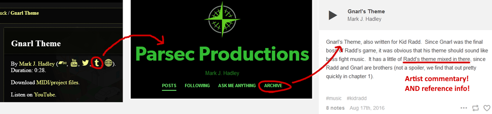
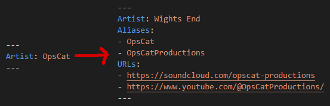
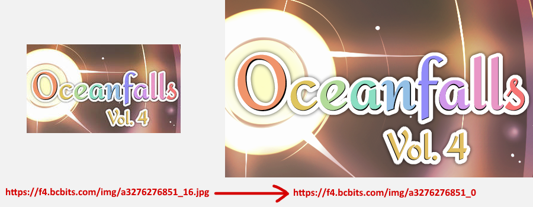

# So You Want to Add an Album

### Getting Started

[Stop by the HSMusic Wiki Discord if you haven't already.](https://hsmusic.wiki/discord/)

This guide assumes you have a basic knowledge of how to locally build and edit the wiki. Refer to the [hsmusic-wiki README](https://github.com/hsmusic/hsmusic-wiki#readme) for a primer. You should be working off the `preview` branch of `hsmusic-data`. You should also be familiar with our data formats for [albums](../documents/album.md) and [tracks](../documents/track.md). We will be working with [Oceanfalls Vol. 4](https://nightslights.bandcamp.com/album/oceanfalls-vol-4) as an example.

The first thing to do is to investigate the album. Almost all albums relevant to HSMusic Wiki are hosted on Bandcamp, but you will have to check for YouTube, SoundCloud, and Spotify uploads, compare dates and look for any scraps of additional information about the album. Common places to check are the social media accounts of the person or project responsible for the album, circa its release date. For less recent albums, use the [Wayback Machine](https://web.archive.org/) to check for removed tracks or Bandcamp page themeing. Check each individual track page. You should also have on hand a genuine, complete copy of the album in question, including all available bonus material.

Make sure that you understand the context surrounding the album. Understanding what the album is about, what the artists' other works are, when the album was released, et cetera. This familiarity will allow you to keep a mental shortlist of the sort of music references, lyrics, and sample usage to expect, saving you from blind guesswork when information is lacking. The wiki itself is an invaluable resource for this.

### Researching Artists

This can be a formidable task for large, collaborative albums. The greatest threat that you should avoid at *all costs* is __mistaking an alternate alias for an artist as a completely different person__. Internet users love to flit from handle to handle; artists even more so, making this is a common threat. Check all the names involved with the album against the wiki's [artists.yaml](https://github.com/hsmusic/hsmusic-data/blob/release/artists.yaml) file. Don't just paste in full names to Ctrl+F: online handles often undergo slight variations, so it's safer to type in portions of each name to check for partial matches. Start Google searching everyone who appears to be new to the wiki. Artists also tend to love to advertise their social media accounts and will often leave a 'trail' of links through progressively older accounts, so pay special attention to 'About me' sections and links. Every new username found is a new search term. Even for artists already on the wiki, a cursory search is often warranted, especially for empty-looking artist entries.

When you're reasonably confident in your efforts, add the information you've found to `artists.yaml`. It may seem like overkill, but these account links and aliases are a valuable tool to ensure that artists are properly credited, and to find information on music. It's often happened that artists will append information about their music when uploading to their personal accounts that would have costed you dear effort to deduce on your own.


<sub>I wouldn't have caught this reference without finding this post</sub>

Checking back on Oceanfalls, the name `Wights End` is new, and doesn't seem to yield anything when searched, except for more Oceanfalls music pages... some for Oceanfalls Vol. ***3***, which is already on the wiki. Looking into it, all of these older tracks are by `OpsCat`, who's clearly using a new handle and has had it changed on some (but not all!) of their old tracks. If those older tracks hadn't been changed, or the discrepancy gone unnoticed, errors could have been introduced to the wiki. *BE VIGILANT!*

The wiki only allows for a single named to be displayed for an artist, with all other names being listed under the `Alias` field. This should be an artist's **preferred** name. Sometimes this will be obvious, such as when an artist abandons an old name entirely and rebrands under a new one. Often enough though, artists will have multiple aliases in active, concurrent use. Typically, you should lean towards whatever name the artist is releasing music under (or artwork, in the relevant cases), or whatever name is more well-known. In our example, we'll have to change `OpsCat`'s artist entry with one for `Wights End`, since it's a newer name. [See here for tips on changing an artist's name.](../guidelines/artist-name-changes.md)


<sub>We've also added some social media links we found during our research</sub>

When casting such a wide net, you will run into all sorts of information. People are not as good as they should be at practicing good information hygiene. __Please remember to be conscientious about what you find__, especially with regards to personally identifying information. Of especial note are deadnames: unless the artist continues to publicly acknowledge their deadname, all usage of them should be strictly replaced throughout the wiki with the sole exception of their `Alias` list. It is silently kept there with the sole purpose of avoiding accidental usage of the nickname by future contributions to the wiki.

### Adding Media

To save yourself the trouble of manually downloading and renaming every single track artwork off of Bandcamp, you can use [this utility](https://github.com/Niklink/bc-art). It will not only download all track artwork at its highest possible resolution but also rename them to the wiki's filename scheme for you! Remember to use the `hsmusicwiki` branch of the tool, then just run the command, in this case `bc.py --albums https://nightslights.bandcamp.com/album/oceanfalls-vol-4`.

Since the track titles for Oceanfalls Vol. 4 include the names of their composers, in this case I'll still have to individually rename each file. For any track where a custom `Directory` has been set, remember to change its media to match! Album covers, banners, and backgrounds will also need to be manually downloaded and renamed to special filenames `cover`, `banner`, and `bg`. [See here for guidelines on banners and backgrounds.](../guidelines/banners-backgrounds.md) To ensure you are downloading the highest resolution images from Bandcamp, replace the numbers after the `_` near the end image URLs with `0`, ignoring the file extension altogether:


<sub>Left: 700x700 JPG, Right: 1400x1400 PNG</sub>

Place everything in a folder with a name matching the album's `Directory` value under `album-art` in your local copy of the [hsmusic-media repo](https://git.ed1.club/nebula/hsmusic-media/). Any additional files you have located in your research or included as bonus material with the album download go under `album-additional` instead. These are usually commentary booklets, bonus artwork, and sheet music or MIDI files, but really, anything goes, *unless* the material is exclusively obtained by purchasing an album.

We currently lack a way to obtain bonus track artwork from Bandcamp servers, even for purchased albums. If you are unable to locate a copy of the artwork during your research, you will have to rip it directly from the track metadata, using a utility such as [Mp3tag](https://www.mp3tag.de/en/).

### Setting Up Your YAML

[**This folder contains YAML files automatically generated from Bandcamp pages for 250+ Homestuck fan albums of all sorts.**](https://mega.nz/folder/7VUgQBwR#UZLdwcmAycRnjLJ33qJNOg) Basic info only: titles, durations, and Bandcamp URLs. If it's not in this list (as in this example) you'll have to create the file yourself, naming it to match the album's `Directory` value. First we fill out the fields for the album itself:

```YAML
Album: Oceanfalls Vol. 4
Date: January 25, 2023
URLs:
- https://nightslights.bandcamp.com/album/oceanfalls-vol-4
- https://www.youtube.com/watch?v=FCYAQhBv0kE
Color: '#dda9ca'
Cover Artists:
- nights
Cover Art File Extension: png
Track Art File Extension: png
Groups:
- Oceanfalls
- Beyond
Art Tags:
- Aria (Oceanfalls)
- Five (Oceanfalls)
- Meimona (Oceanfalls)
- Reed (Oceanfalls)
---
```

With only that, the wiki can already be built successfully. I strongly recommend rebuilding the wiki as often as possible while you work to check for mistakes on the page or in the build output. **Use the `--live-dev-server` flag; it makes building ~2x faster** (you don't need to set `out-path` if using this flag).

Decide on what fields you need to include on every (or almost every) track, to set up an empty one. This will depend on whether your album is solo or collaborative, whether each track has unique artwork, et cetera. For our example we need something like this:

```YAML
Track: 
Artists:
- 
Duration: 
URLs:
- 
Cover Artists:
- 
Art Tags:
- 
---
```

If you're using the autogenerated files and want to edit the fields, use [regular expressions](https://regex101.com/r/gFExrg/1). Cheat sheet: to remove the `Artists` field you can replace `Artists:\r\n- \r\n` with an empty string, and to add fields you can replace `---` with, say, `Cover Artists:\r\n- \r\n---`. `\r\n` = a line break, is the takeaway. Even if you aren't using the premade files you can regex the text from the album's Bandcamp page to save on typing out track titles and durations.

### Actually Entering the Data

Now, you actually fill out the YAML! I usually listen to each track at least twice while I work on that track's entry; filling out all the hard data the first time and then listening very closely for any references, samples, or lyrics the second time around, and rebuilding the wiki every so often to see that everything is being done properly and no errors are being issued (you'll have to remove all the empty unfilled tracks to do this, then put them back). [If any track references or samples music not on the wiki, you'll have to follow a few extra steps to add them.](../guidelines/adding-additional-tracks.md) Here's our first completed track:

```YAML
Track: Up From the Depths
Artists:
- Wights End
Duration: 05:24
URLs:
- https://nightslights.bandcamp.com/track/up-from-the-depths
Cover Artists:
- Wights End
Cover Art File Extension: jpg
Art Tags:
- Reed (Oceanfalls)
---
```

- The ordering of fields for each item is not standardized across the wiki, except for `Album` or `Track` being the first listed, followed by `Directory` and `Originally Released As`
- `Artists` and `Contributors` should be listed in the same order as officially credited, or in rough order of importance to the creation of the track otherwise
- `URLs` should list listening links made by the album creators first, with priority given to the original links if possible (usually Bandcamp)
- `Referenced Tracks` and `Sampled Tracks` should be listed by order of appearance in the track
- `Art Tags` should list characters, then locations, then content warnings, in rough order of prevalence within the artwork

### Checklist for Verifying You’ve Done Everything

-wip-

### Submitting Your Work

Open a pull request on the `hsmusic-data` repo, targeting the `preview` branch. You can add multiple albums in one PR if you wish, however each album should be committed to your local branch one at a time.

You will also have to upload your changes to `hsmusic-media` separately and include them in the PR. If you've only added new folders to `album-art` and `album-additional`, you can upload those folders directly. If you've had to change or add media anywhere else on the wiki, you should [create a git patch](https://git-scm.com/docs/git-format-patch) and upload that instead.